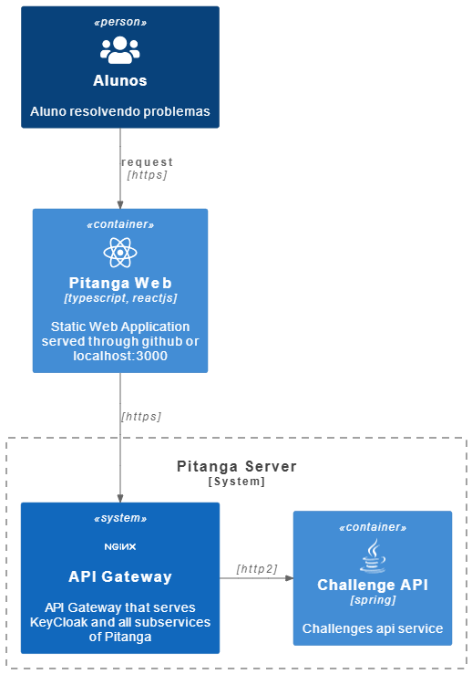

<div style="text-align: center;">
    
    <h3>Pitanga</h3>
</div>

## Sobre

Pitanga é uma ferramenta online destinada a auxiliar o aprendizado de programação, que utiliza conceitos de mobile-learning e através do aprendizado baseado em problemas (PBL) visa ampliar o conhecimento produzido em aula para fora dos limites da sala.

### Visão arquitetural
<div style="text-align: center;">

</div>

## Install and start server:

```bash
# create your .env file and remember to update the values
cp .env.example .env

# it may be necessary to set sudo permission
./install.sh
```
